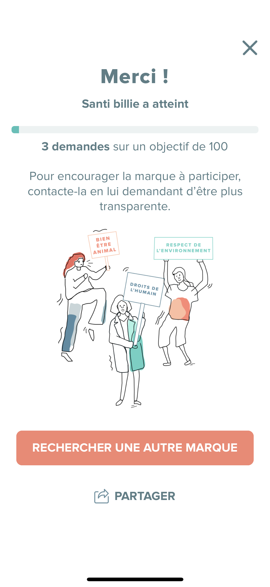
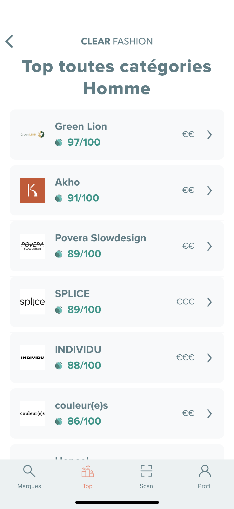
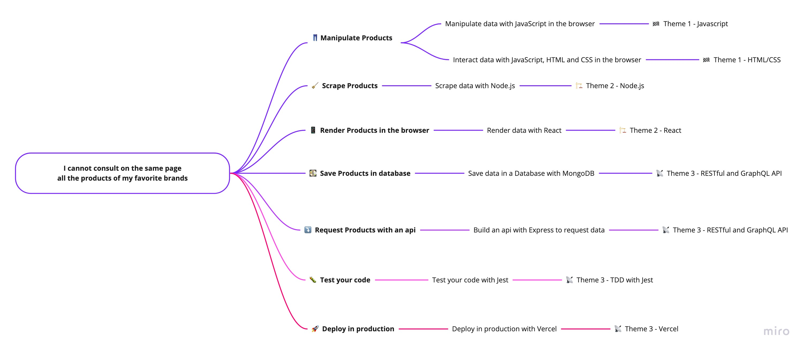

# 👕 Clear Fashion

> What's the story behind each item of clothing you buy?

<!-- START doctoc generated TOC please keep comment here to allow auto update -->
<!-- DON'T EDIT THIS SECTION, INSTEAD RE-RUN doctoc TO UPDATE -->
**Table of Contents**

- [📱 Context](#-context)
- [🤔 Problems](#-problems)
- [🎯 Objective](#-objective)
- [🛣 How to solve it?](#%F0%9F%9B%A3-how-to-solve-it)
- [👩🏽‍💻 Step by step with Workshops](#%E2%80%8D-step-by-step-with-workshops)
- [🌱 Source and Inspiration](#-source-and-inspiration)
- [📝 Licence](#-licence)

<!-- END doctoc generated TOC please keep comment here to allow auto update -->

## 📱 Context

[Clear Fashion](https://www.clear-fashion.com/) is an iOS and Android application that allows you **to choose environmentally & human-friendly clothes**.

With Clear Fashion, you will get an analysis **with transparency and independency** of the commitments of brands according to 4 themes: Human, Health, Environment & Animals.

 

 

 

## 🤔 Problems

Clear Fashion is particularly committed to ensuring that there are **no conflicts due to commercial interests**.

The problems as consumer are

1. **I cannot open my favorite brands shop links**
1. **I cannot consult on the same page all the products of my favorite brands**

I have to search on google the e-shop link for all brands.

I have to browse each e-shop brand to look for a product.

## 🎯 Objective

**Build a web application to list my favorite top responsible brands Products.**

## 🛣 How to solve it?

1. 👖 **Manipulate Products**: How to [manipulate](https://github.com/92bondstreet/javascript-empire/blob/master/themes/1.md#about-javascript) the products in the [browser](https://github.com/92bondstreet/javascript-empire/blob/master/themes/1.md#about-htmlcss)
2. 🧹 **Scrape Products**: How to [fetch](https://github.com/92bondstreet/javascript-empire/blob/master/themes/2.md#about-nodejs) Products from different website sources
3. 📱 **Render Products in the browser**: How to [interact](https://github.com/92bondstreet/javascript-empire/blob/master/themes/2.md#about-react) with the Products in the browser
4. 💽 **Save Products in database**: How to avoid to scrape again and again the same data
5. ⤵️ **Request Products with an api**: How to [give access](https://github.com/92bondstreet/javascript-empire/blob/master/themes/3.md#about-restful-and-graphql-api) to your data
6. 🐛 **Test your code**: How to [ensure quality](https://github.com/92bondstreet/javascript-empire/blob/master/themes/3.md#about-test-driven-development) and confidence
7. 🚀 **Deploy in production**: How to [give access](https://github.com/92bondstreet/javascript-empire/blob/master/themes/3.md#about-serverless) to anyone

## 👩🏽‍💻 Step by step with Workshops

With [javascript-empire](https://github.com/92bondstreet/javascript-empire#%EF%B8%8F-the-3-themes) themes, we'll follow next workshops to solve our problem:

| Step | Workshops | Planned Date
| --- | --- | ---
| 1 | [Manipulate data with JavaScript in the browser](./workshops/1-manipulate-javascript.md) | 17 January 2022
| 2 | [Interact data with JavaScript, HTML and CSS in the browser again](./workshops/2-interact-js-css.md) | 24 January 2022
| 3 | [Scrape data with Node.js](./workshops/3-scrape-node.md) | 31 January and 7 February 2022
| 4 | [Save data in a Database with MongoDB](./workshops/4-store-mongodb.md) | 14 February 2022
| 5 | [Build an api with Express to request data](./workshops/5-api-express.md) | 7 March 2022
| 6 | Test your code with Jest | 14 March 2022
| 7 | [Deploy in production with Vercel](./workshops/7-deploy.md) | 21 and 22 March 2022
| 8 | Render data with React | April 2022 extra mile

## 🌱 Source and Inspiration

* [Clear Fashion](https://www.clear-fashion.com/)

## 📝 Licence

[Uncopyrighted](http://zenhabits.net/uncopyright/)
