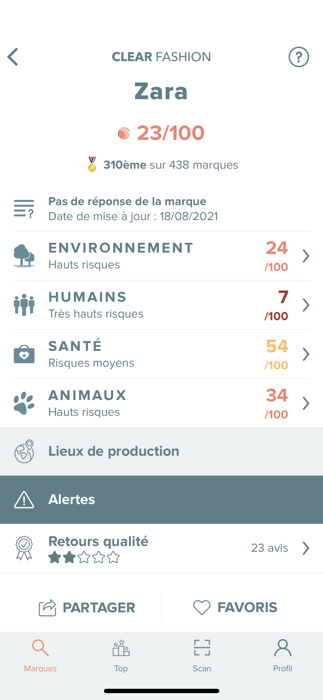
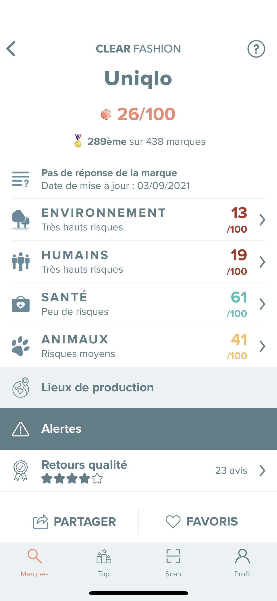
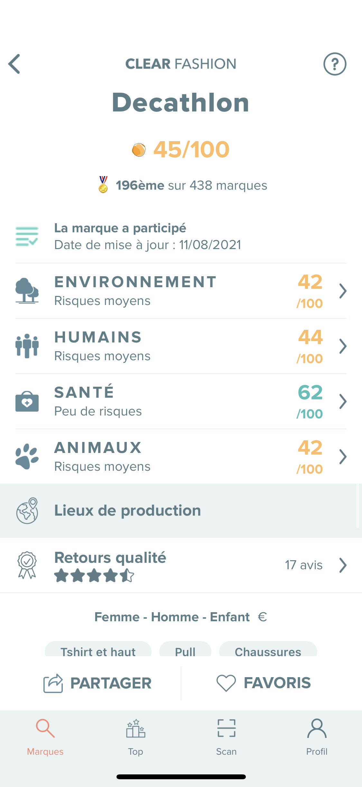
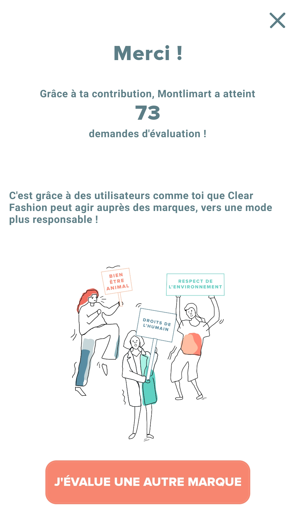
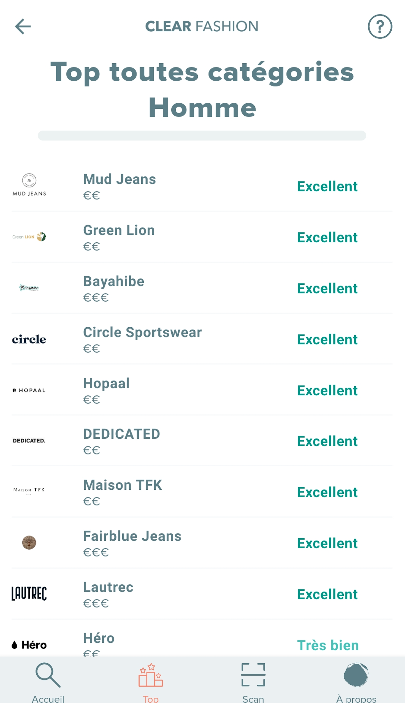
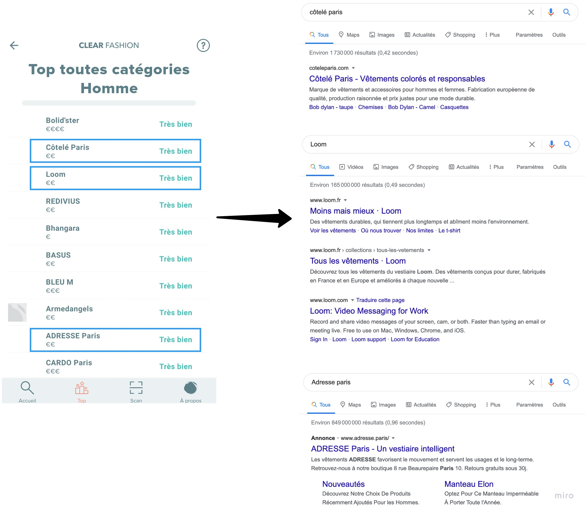
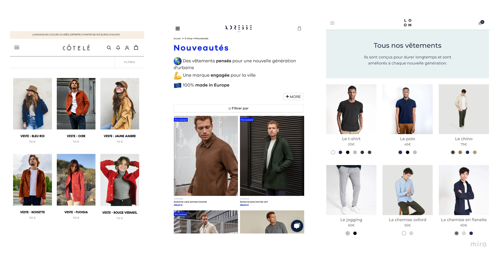
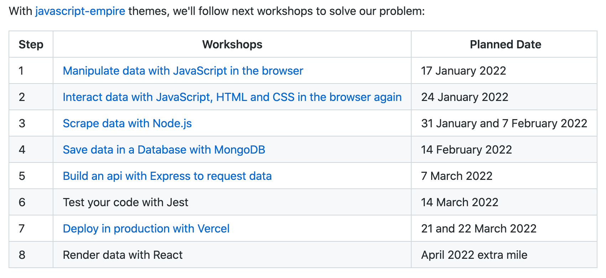

💙 Clear Fashion

---

How to choose environmentally & human-friendly clothes

---

4 themes commitments: Human, Health, Environment & Animals

---

 <!-- .element height="50%" width="50%" -->

---

 <!-- .element height="50%" width="50%" -->

---

 <!-- .element height="50%" width="50%" -->

---

 <!-- .element height="50%" width="50%" -->

---

 <!-- .element height="50%" width="50%" -->

---

 <!-- .element height="50%" width="50%" -->

---

💶 **No conflicts due to commercial interests**

---

🤔 My Problem

---

🔗 I cannot open my favorite brands shop links

---

📱 I cannot consult on the same page **all the products** of my favorite brands

---

---

---

😁 Help me with a Web Application

---

🎯 Build a Web Application to list my favorite top responsible brands Products

---

Good Luck.

📅 See you in 22th March.

---

🛣 How to solve it?

---

👖 Manipulate Products

How to manipulate the products in the browser

---

🧹 Scrape Products

How to fetch Products from different website sources

---

📱 Render Products in the browser

How to interact with the Products in the browser

---

💽 Save Products in database

How to avoid to scrape again and again the same data

---

⤵️ Request Products with api

How to give access to your data

---

🐛 Test your code

How to ensure quality and confidence

---

🚀 Deploy in production

How to give access to anyone

---

🤔 What do you notice?

---

No code

---

---

---

👩🏽‍💻 Just tell me what to do

---

92bondstreet/clear-fashion

---

* Fork the project via `github`
* Clone the project
* Read the `README`

---

🎙 A.M.A
