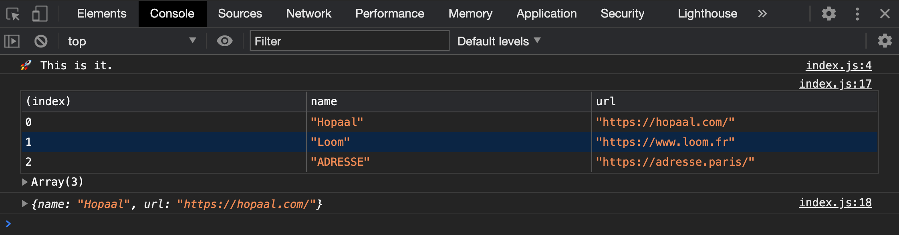
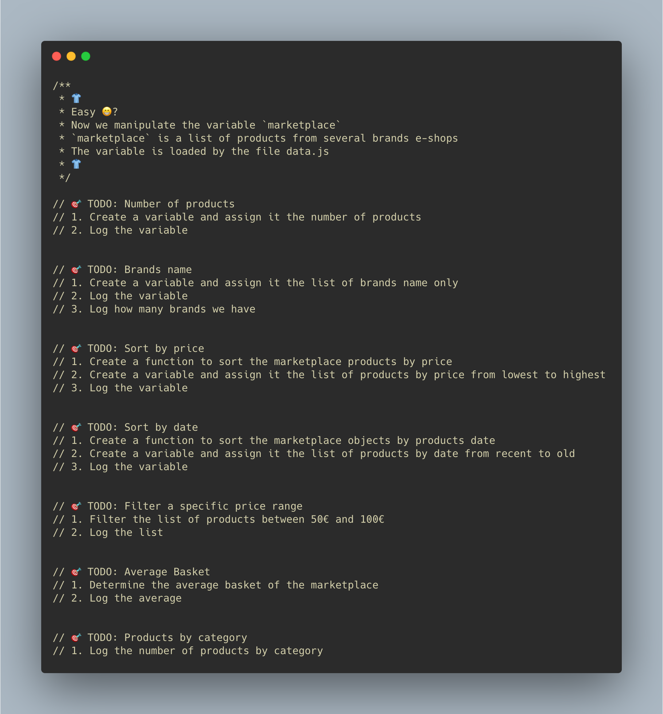

# 👖 Step 1 - Manipulate Products

> How to manipulate data with JavaScript in the browser

<!-- START doctoc generated TOC please keep comment here to allow auto update -->
<!-- DON'T EDIT THIS SECTION, INSTEAD RE-RUN doctoc TO UPDATE -->
**Table of Contents**

- [🎯 Objective](#-objective)
- [🏗 Prerequisites](#%F0%9F%8F%97-prerequisites)
- [👩‍💻 Just tell me what to do](#%E2%80%8D-just-tell-me-what-to-do)
  - [Don't forget. 5 Focus.](#dont-forget-5-focus)
- [🛣️ Related Theme and courses](#-related-theme-and-courses)

<!-- END doctoc generated TOC please keep comment here to allow auto update -->


## 🎯 Objective

```
Getting starting with the programming Language JavaScript to manipulate array, objects, functions etc...
```

## 🏗 Prerequisites

1. Be sure **to have a GitHub account**.

If not, you should create a [GitHub account](https://github.com/join) then [add your ssh to your github profile](https://help.github.com/articles/connecting-to-github-with-ssh) for a simpler authentication.

2. **Fork** the repository via `github`


3. **Clone your forked repository** `https://github.com/YOUR_USERNAME/clear-fashion`

```sh
❯ cd /path/to/workspace
❯ git clone git@github.com:YOUR_USERNAME/clear-fashion.git
```

4. **Open the entry point [../client/v1/index.html](../client/v1/index.html)** in your browser (that loads the `index.js` file)

```sh
# macos cli
❯ open client/v1/index.html
# linux cli
❯ xdg-open client/v1/index.html

# or by double-clicking in your browser files
```

5. **Check the ouput in your browser console** (Use `Ctrl + Shift + J` or `Cmd + Opt + J` to focus to your console devtools)



## 👩‍💻 Just tell me what to do

1. **Solve each `TODO`** inside [../client/v1/index.js](../client/v1/index.js) file with JavaScript




2. Once a TODO is solved, **commit your modification**:

```sh
❯ cd /path/to/workspace/clear-fashion
❯ git add -A && git commit -m "feat(lowest): compute number of products"
```

([why following a commit message convention?](https://dev.to/chrissiemhrk/git-commit-message-5e21))

3. **Commit early, commit often**
4. Don't forget **to push before the end of the workshop**

```sh
❯ git push origin master
```

**Note**: if you catch an error about authentication, [add your ssh to your github profile](https://help.github.com/articles/connecting-to-github-with-ssh/).

10. Check that your codebase works by checking the console output
11. If you need some helps on git commands, read [git - the simple guide](http://rogerdudler.github.io/git-guide/)

### Don't forget. 5 Focus.

* DRY - Don't repeat yourself
* DOT - Do One Thing
* KISS - Keep It Simple Stupid
* LIM - Less Is More
* English only: codebase, variables, comments...

**Focus only on coding, forgot the browser display (next workshop!).**

**Use console.log or [console.table](https://developer.mozilla.org/en-US/docs/Web/API/Console/table) to display results (for the moment)**


## 🛣️ Related Theme and courses

* 🏁 [Theme 1 - About Javascript](https://github.com/92bondstreet/javascript-empire/blob/master/themes/1.md#about-javascript)
