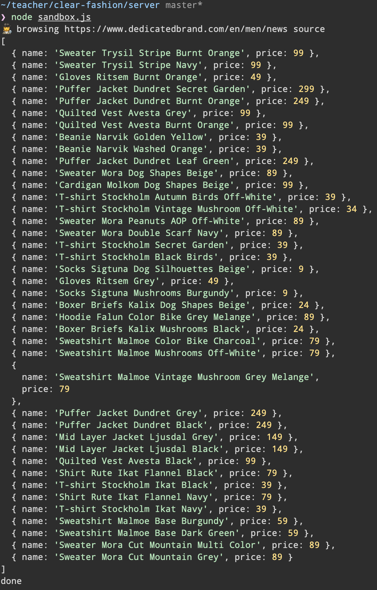
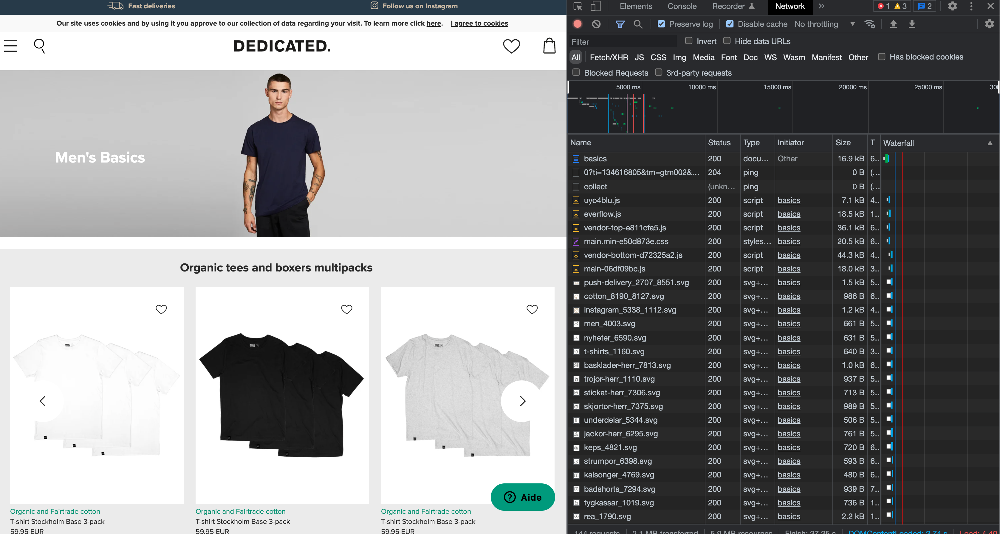
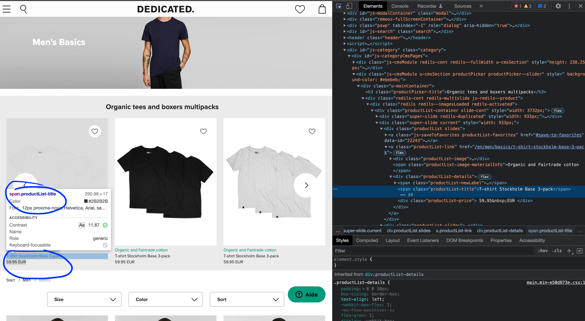

# 🧹 Step 3 - Scrape the Products

> How to manipulate and data with JavaScript from server side

<!-- START doctoc generated TOC please keep comment here to allow auto update -->
<!-- DON'T EDIT THIS SECTION, INSTEAD RE-RUN doctoc TO UPDATE -->
**Table of Contents**

- [🎯 Objective](#-objective)
- [🏗 Prerequisites](#%F0%9F%8F%97-prerequisites)
- [📱 How to scrape with Node.js? 1 example to do it](#-how-to-scrape-with-nodejs-1-example-to-do-it)
  - [Step 1. No code, Investigation first](#step-1-no-code-investigation-first)
  - [Step 2. Server-side with Node.js](#step-2-server-side-with-nodejs)
- [📦 Suggested node modules](#-suggested-node-modules)
- [👕 A complete Scraping Example for dedicatedbrand.com](#-a-complete-scraping-example-for-dedicatedbrandcom)
- [👩‍💻 Just tell me what to do](#%E2%80%8D-just-tell-me-what-to-do)
- [🛣️ Related Theme and courses](#-related-theme-and-courses)

<!-- END doctoc generated TOC please keep comment here to allow auto update -->


## 🎯 Objective

**Scrape products with Node.js and use JavaScript as server-side scripting to manipulate and interact with array, objects, functions...**

## 🏗 Prerequisites

1. Be sure **to have a clean working copy**.

This means that you should not have any uncommitted local changes.

```sh
❯ cd /path/to/workspace/clear-fashion
❯ git status
On branch master
Your branch is up to date with 'origin/master'.

nothing to commit, working tree clean
```

2. **Pull** the `master` branch to update your local with the new remote changes

```sh
❯ git remote add upstream git@github.com:92bondstreet/clear-fashion.git
## or ❯ git remote add upstream https://github.com/92bondstreet/clear-fashion
❯ git fetch upstream
❯ git pull upstream master
```

3. **Check the terminal output for the command `node sandbox.js`**

```sh
❯ cd /path/to/workspace/clear-fashion/server
## install dependencies
❯ yarn
## or ❯ npm install
❯ node sandbox.js
```



4. **If nothing happens or errors occur**, check your [node server installation (from Theme 2)](https://github.com/92bondstreet/javascript-empire/blob/master/themes/2.md#-just-tell-me-what-to-do)

## 📱 How to scrape with Node.js? 1 example to do it

Let's try to scrape products from the e-shop brand [Dedicated](https://www.dedicatedbrand.com/en/).


### Step 1. No code, Investigation first

1. Browse the website
1. How the e-shop https://www.dedicatedbrand.com/en/ works?
1. How can I access to the different products pages?
1. What are the given properties for a `Product`: name, price, category, link...?
1. Check how that you can get list of Products: web page itself, api etc.... (Inspect Network Activity - with [Chrome DevTools for instance](https://developers.google.com/web/tools/chrome-devtools/network) - on any browser)
1. Define the JSON object representation for a Product
1. ...
1. ...





### Step 2. Server-side with Node.js

Create a module called `dedicatedbrand` that returns the list of Products for a given url page of [Dedicated](https://www.dedicatedbrand.com/en/).

An Example of page to scrape: https://www.dedicatedbrand.com/en/men/news


```js
const dedicatedbrand = require('dedicatedbrand');

const products = dedicatedbrand.scrape('https://www.dedicatedbrand.com/en/men/news');

products.forEach(product => {
  console.log(products.name);
})
```

## 📦 Suggested node modules

* [axios](https://github.com/axios/axios) - Promise based HTTP client for the browser and node.js
* [cheerio](https://github.com/cheeriojs/cheerio) - Fast, flexible, and lean implementation of core jQuery designed specifically for the server.
* [nodemon](https://github.com/remy/nodemon) - Monitor for any changes in your node.js application and automatically restart the server - perfect for development

## 👕 A complete Scraping Example for dedicatedbrand.com

[server/sources/dedicatedbrand.js](../server/sources/dedicatedbrand.js) contains a function to scrape a given [Dedicated](https://www.dedicatedbrand.com/en/) products page.

To start the example, call with node cli or use the Makefile target:

```sh
❯ cd /path/to/workspace/clear-fashion/server
❯ node sandbox.js
❯ node sandbox.js "https://www.dedicatedbrand.com/en/men/t-shirts"
❯ ## make sandbox-sever
❯ ## ./node_modules/.bin/nodemon sandbox.js
```


```js
const axios = require('axios');
const cheerio = require('cheerio');

/**
 * Parse webpage e-shop
 * @param  {String} data - html response
 * @return {Array} products
 */
const parse = data => {
  const $ = cheerio.load(data);

  return $('.productList-container .productList')
    .map((i, element) => {
      const name = $(element)
        .find('.productList-title')
        .text()
        .trim()
        .replace(/\s/g, ' ');
      const price = parseInt(
        $(element)
          .find('.productList-price')
          .text()
      );

      return {name, price};
    })
    .get();
};

/**
 * Scrape all the products for a given url page
 * @param  {[type]}  url
 * @return {Array|null}
 */
module.exports.scrape = async url => {
  const response = await axios(url);
  const {data, status} = response;

  if (status >= 200 && status < 300) {
    return parse(data);
  }

  console.error(status);

  return null;
};
```


## 👩‍💻 Just tell me what to do

1. **Scrape Products for the 3 Brands** defined by the json file [../server/brands.json](../server/brands.json)

2. **Store the list into a JSON file**

2.  **Commit your modification**

```sh
❯ cd /path/to/workspace/clear-fashion
❯ git add -A && git commit -m "feat(shop): scrape new products"
```

([why following a commit message convention?](https://dev.to/chrissiemhrk/git-commit-message-5e21)

3. **Commit early, commit often**
4. Don't forget **to push before the end of the workshop**

```sh
❯ git push origin master
```

**Note**: if you catch an error about authentication, [add your ssh to your github profile](https://help.github.com/articles/connecting-to-github-with-ssh/).

5. If you need some helps on git commands, read [git - the simple guide](http://rogerdudler.github.io/git-guide/)


## 🛣️ Related Theme and courses

* 🏗 [Theme 2 - About Node.js](https://github.com/92bondstreet/javascript-empire/blob/master/themes/2.md#about-nodejs)
