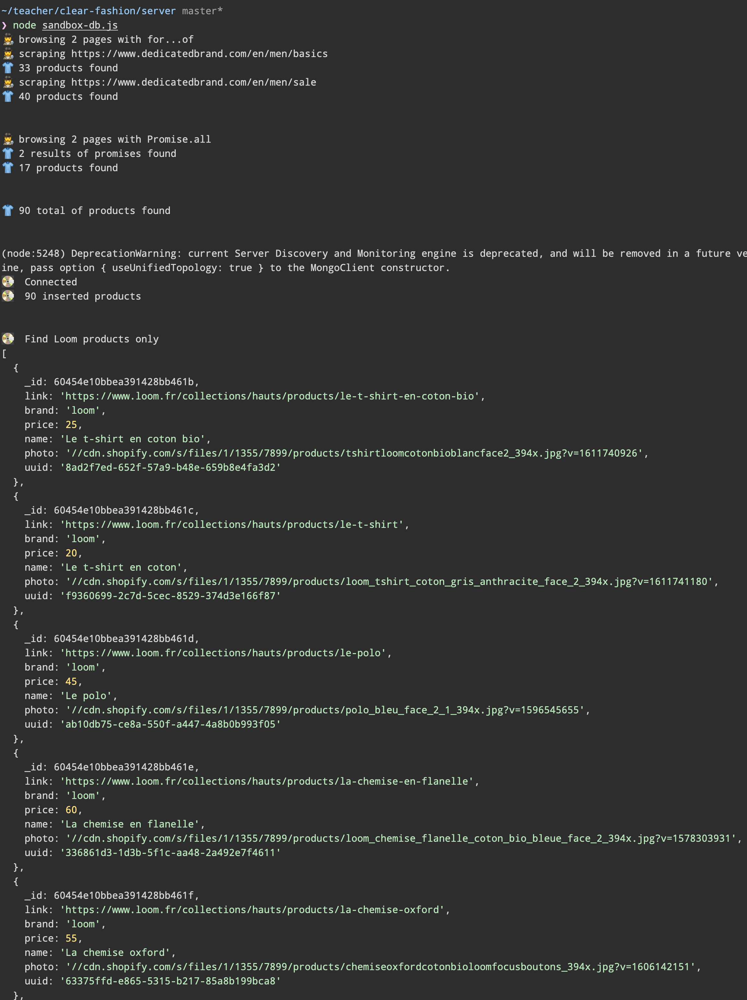
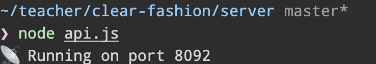
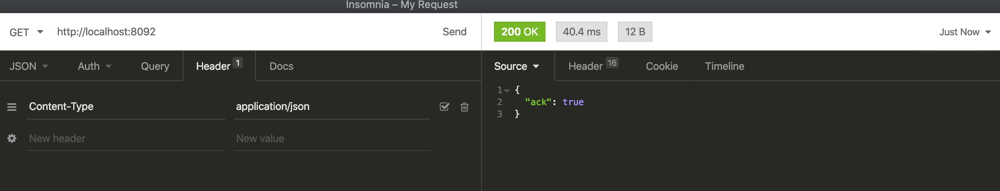

# ⤵️ Step 5 - Request the Products

> How to give access to your data

<!-- START doctoc generated TOC please keep comment here to allow auto update -->
<!-- DON'T EDIT THIS SECTION, INSTEAD RE-RUN doctoc TO UPDATE -->
**Table of Contents**

- [🎯 Objective](#-objective)
- [🏗 Prerequisites](#%F0%9F%8F%97-prerequisites)
- [⤵️ List of endpoints to implement](#-list-of-endpoints-to-implement)
    - [`GET /products/:id`](#get-productsid)
    - [`GET /products/search`](#get-productssearch)
- [👩‍💻 Just tell me what to do](#%E2%80%8D-just-tell-me-what-to-do)
- [📦 Suggested node modules](#-suggested-node-modules)
- [🛣️ Related Theme and courses](#-related-theme-and-courses)

<!-- END doctoc generated TOC please keep comment here to allow auto update -->


## 🎯 Objective

**Build an api with Express to request data from your database...**

## 🏗 Prerequisites

1. Be sure **to have a clean working copy**.

This means that you should not have any uncommitted local changes.

```sh
❯ cd /path/to/workspace/clear-fashion
❯ git status
On branch master
Your branch is up to date with 'origin/master'.

nothing to commit, working tree clean
```

2. **Pull** the `master` branch to update your local with the new remote changes

```sh
❯ git remote add upstream git@github.com:92bondstreet/clear-fashion.git
## or ❯ git remote add upstream https://github.com/92bondstreet/clear-fashion
❯ git fetch upstream
❯ git pull upstream master
```

3. **Check the terminal output for the command `node sandbox-db.js`**

```sh
❯ cd /path/to/workspace/clear-fashion/server
## install new dependencies
❯ yarn
## or ❯ npm install
❯ node sandbox-db.js
```



3. **Check the terminal output for the command `node api.js`**

```sh
❯ cd /path/to/workspace/clear-fashion/server
## install new dependencies
❯ yarn
## or ❯ npm install
❯ node api.js
```



## ⤵️ List of endpoints to implement

#### `GET /products/:id`

Fetch a specific product.

```sh
❯ curl -H "Accept: application/json" http://localhost:8092/products/f9360699-2c7d-5cec-8529-374d3e166f87
{
    "_id": "f9360699-2c7d-5cec-8529-374d3e166f87",
    "link": "https://www.loom.fr/collections/hauts/products/le-t-shirt",
    "brand": "loom",
    "price": 20,
    "name": "Le t-shirt en coton",
    "photo":"//cdn.shopify.com/s/files/1/1355/7899/products/loom_tshirt_coton_gris_anthracite_face_2_394x.jpg?v=1611741180"
}
```

#### `GET /products/search`

Search for specific products

This endpoint accepts the following optional query string parameters:

- `limit` - number of products to return (default: 12)
- `brand` - filter by brand (default: All brands)
- `price` - filter by price (default: All price)


The results array should be sorted by price in ascending way.

```sh
❯ curl -H "Accept: application/json" http://localhost:8092/products/search?limit=5&brand=loom&price=30
{
  "limit": 5,
  "total": 2,
  "results": [
    {
        "_id": "f9360699-2c7d-5cec-8529-374d3e166f87",
        "link": "https://www.loom.fr/collections/hauts/products/le-t-shirt",
        "brand": "loom",
        "price": 20,
        "name": "Le t-shirt en coton",
        "photo":"//cdn.shopify.com/s/files/1/1355/7899/products/loom_tshirt_coton_gris_anthracite_face_2_394x.jpg?v=1611741180"
    },
    {
        "_id": "8ad2f7ed-652f-57a9-b48e-659b8e4fa3d2",
        "link": "https://www.loom.fr/collections/hauts/products/le-t-shirt-en-coton-bio",
        "brand": "loom",
        "price": 25},
        "name": "Le t-shirt en coton bio",
        "photo": "//cdn.shopify.com/s/files/1/1355/7899/products/tshirtloomcotonbioblancface2_394x.jpg?v=1611740926"
    }
  ]
}
```

## 👩‍💻 Just tell me what to do

1. **Install the desktop API client** [Insomnia](https://insomnia.rest)

2. **Check the API endpoint** [`/`](../server/api.js) with insomnia



3. **Implement the endpoints**

4.  **Commit your modification**

```sh
❯ cd /path/to/workspace/clear-fashion
❯ git add -A && git commit -m "feat(get-product): get a specific product"
```

([why following a commit message convention?](https://dev.to/chrissiemhrk/git-commit-message-5e21)

5. **Commit early, commit often**
6. Don't forget **to push before the end of the workshop**

```sh
❯ git push origin master
```

**Note**: if you catch an error about authentication, [add your ssh to your github profile](https://help.github.com/articles/connecting-to-github-with-ssh/).

If you need some helps on git commands, read [git - the simple guide](http://rogerdudler.github.io/git-guide/)


## 📦 Suggested node modules

- [dotenv](https://www.npmjs.com/package/dotenv) - Loads environment variables from .env for nodejs projects
- [express](https://www.npmjs.com/package/express) - Fast, unopinionated, minimalist web framework for node
- [nodemon](https://www.npmjs.com/package/nodemon) - Monitor for any changes in your node.js application and automatically restart the server - perfect for development

## 🛣️ Related Theme and courses

* 📡 [Theme 3 - About RESTful and GraphQL API](https://github.com/92bondstreet/javascript-empire/blob/master/themes/3.md#about-restful-and-graphql-api)
